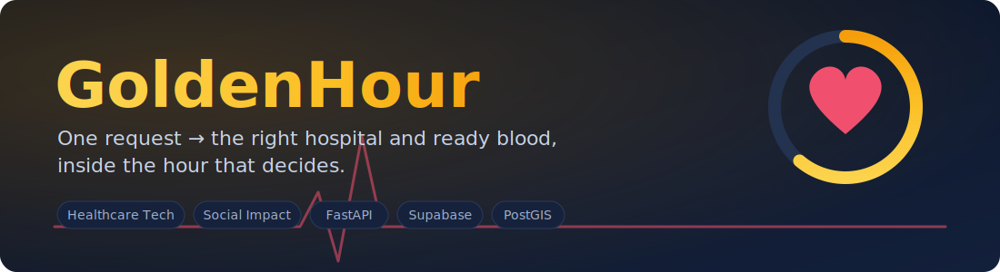
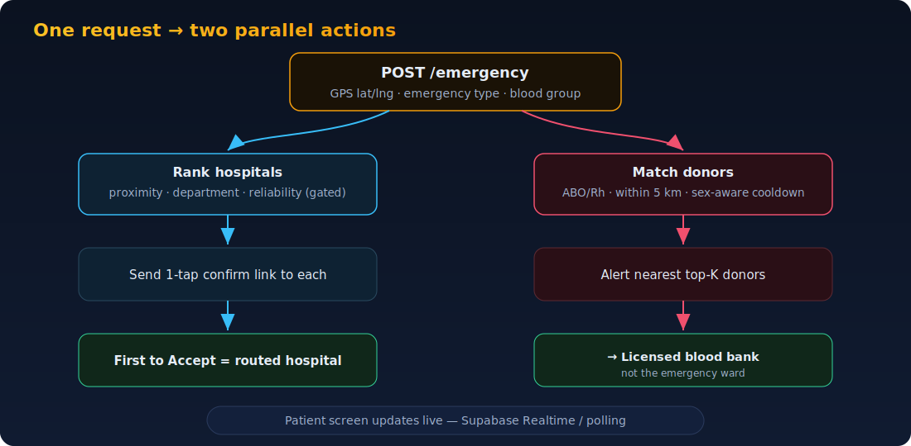
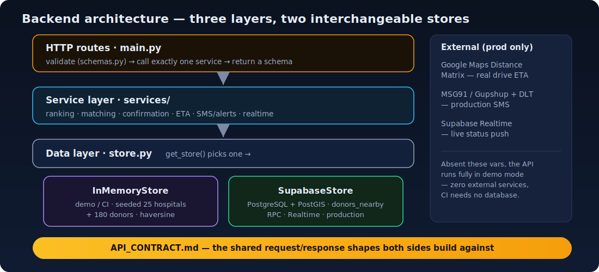

<p align="center">
  
</p>

<p align="center">
  
  
  
  
  
  
  
</p>

# GoldenHour

> One tap. Two lifelines. The right hospital and the right blood — before the car even moves.

**GoldenHour** is a Progressive Web App + feature-phone SMS service that converts
a single GPS-triggered emergency request into two simultaneous, parallel actions:

1. **Locate and confirm a hospital** with the correct department and a free bed.
2. **Alert nearby replacement-blood donors** of a compatible blood group.

It is built for the **self-transporting family in India** — the majority of
emergency patients who travel to hospital by private car or auto, entirely
outside any ambulance system. The "golden hour" after a trauma is when minutes
decide outcomes; GoldenHour spends those minutes finding a hospital that can
actually take the patient instead of driving to one that can't.

**Tags:** `Healthcare Technology` · `Social Impact` · `Emergency Response` · `Bharat Academix CodeQuest 2026` · `FastAPI` · `React` · `Supabase` · `PostGIS` · `PWA`

---

## How it works (end-to-end)

<p align="center">
  
</p>

A single `POST /emergency` fans out into both branches at once. On the **hospital**
side, the backend ranks nearby hospitals and sends each a one-tap confirmation
link; the **first to Accept "takes" the patient**, and later acceptances are told
the patient is already routed. On the **blood** side, it matches compatible donors
within range and alerts the nearest, directing them to the hospital's licensed
blood bank. The patient's screen updates live the instant a hospital confirms.

---

## System architecture

GoldenHour is a two-part system split cleanly by ownership, sharing one contract.
The backend itself is a strict three-layer design with two interchangeable data
stores behind a single `get_store()` — so the demo runs with **zero external
services** and the production path is a true drop-in, no service-code changes:

<p align="center">
  
</p>

- **`API_CONTRACT.md`** is the single source of truth both sides build against.
  The backend's `schemas.py` and the frontend's `fetch()` calls mirror it exactly.
- **The frontend never talks to the database** — only to the API.
- **The backend runs with zero external services in demo mode** (in-memory store
  seeded with Jaipur hospitals + donors), and swaps to Supabase/PostGIS, Google
  Maps, and an SMS gateway when their env vars are present — no code changes.

See [`backend/README.md`](backend/README.md) for the service-layer architecture
and the three algorithms, and [`frontend/README.md`](frontend/README.md) for the
screens and live-update wiring.

---

## Repository structure

```
GoldenHour/
├── API_CONTRACT.md             # SHARED contract — exact API request/response shapes
├── README.md                   # You are here
├── LICENSE
├── docs/                       # README diagrams (banner, flow, architecture SVGs)
├── render.yaml                 # Backend deploy config (Render)
├── vercel.json                 # Frontend deploy config (Vercel)
├── docker-compose.yml          # One-command local backend (demo mode)
│
├── backend/                    # FastAPI service — DB, algorithms, integration
│   ├── main.py                 # Routes (thin HTTP layer)
│   ├── middleware.py           # CORS
│   ├── config.py               # Env-driven settings + demo fallbacks
│   ├── schemas.py              # Pydantic models (= API_CONTRACT.md)
│   ├── blood.py                # ABO/Rh compatibility table
│   ├── geo.py                  # Haversine distance
│   ├── store.py                # Data layer (InMemoryStore + SupabaseStore)
│   ├── seed_data.py            # ~25 hospitals + ~180 donors (deterministic)
│   ├── seed_supabase.py        # Seed a real Supabase DB
│   ├── services/               # Business logic (ranking, matching, confirm, …)
│   ├── sql/schema.sql          # PostGIS tables, indexes, RPC
│   ├── tests/                  # pytest (algorithms + contract + live flow)
│   ├── Dockerfile
│   └── .env.example
│
├── frontend/                   # React + Vite + Tailwind PWA
│   ├── index.html              # Shell + meta/description/OG/PWA tags
│   ├── src/
│   │   ├── App.jsx             # Mobile shell + routes
│   │   └── components/         # PatientIntake, PatientResults, HospitalConfirm, DonorRegistration
│   ├── vite.config.js
│   └── package.json
│
└── .github/workflows/          # CI: backend tests, frontend CI, PR guard
```

---

## Tech stack

| Layer | Technology |
| --- | --- |
| Frontend | React 19, Vite, Tailwind CSS, React Router, Supabase JS client |
| Backend | Python 3.12, FastAPI, Uvicorn, Pydantic v2 |
| Database | PostgreSQL + PostGIS (via Supabase), Supabase Realtime |
| Maps / ETA | Google Maps Distance Matrix API |
| Messaging | Console / Telegram (demo), MSG91 / Gupshup + DLT (production) |
| Infra | Docker, Render (API), Vercel (PWA), GitHub Actions CI |

---

## Quickstart

### Backend (demo mode — no setup, no database)

```bash
cd backend
python -m venv .venv && source .venv/bin/activate   # Windows: .venv\Scripts\activate
pip install -r requirements.txt
uvicorn main:app --reload --port 8000
```

Open <http://localhost:8000/docs>, trigger an emergency, and watch the hospital
confirmation links print to the console (`GET /dev/links`) and the donor alerts
(`GET /dev/alerts`). Run the tests with `pytest`.

Or, with Docker, from the repo root: `docker compose up --build`.

### Frontend

```bash
cd frontend
npm install
npm run dev        # http://localhost:5173
```

Point it at the API by creating `frontend/.env.local` with
`VITE_API_BASE_URL=http://localhost:8000`.

---

## API at a glance

Full shapes in [`API_CONTRACT.md`](API_CONTRACT.md).

| Method & path | Purpose |
| --- | --- |
| `POST /emergency` | Trigger — rank hospitals, alert donors, send confirmation links (`rare_group` flag) |
| `GET /emergency/{request_id}/status` | Live status — hospital replies + donor responses (`unconfirmed_fallback` flag) |
| `POST /confirm/{token}` | Hospital taps Accept / Not Available |
| `POST /donor/register` | Register a replacement-blood donor (optional `sex` for cooldown) |
| `POST /sms/inbound` | Feature-phone SMS path (stretch) |
| `GET /health` · `GET /ready` | Liveness (mode) · readiness (pings the DB) |
| `GET /dev/links` · `GET /dev/alerts` | Demo: links sent to hospitals · alerts sent to donors |

---

## Deployment

| Component | Platform | Config |
| --- | --- | --- |
| Backend API | Render (or Fly.io) | [`render.yaml`](render.yaml) — Python runtime, `rootDir: backend` |
| Frontend PWA | Vercel | [`vercel.json`](vercel.json) — builds `frontend/`, SPA rewrites |
| Database | Supabase | Run [`backend/sql/schema.sql`](backend/sql/schema.sql), enable Realtime |

Production secrets (`SUPABASE_*`, `GOOGLE_MAPS_API_KEY`, `MSG91_AUTH_KEY`,
`VITE_API_BASE_URL`) are set in the respective dashboards — never committed.
See [`DEPLOY.md`](DEPLOY.md) for the full Supabase + Render runbook.

---

## License

[MIT](LICENSE).
